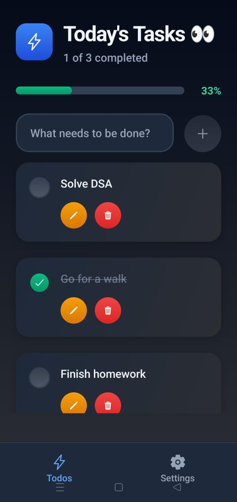
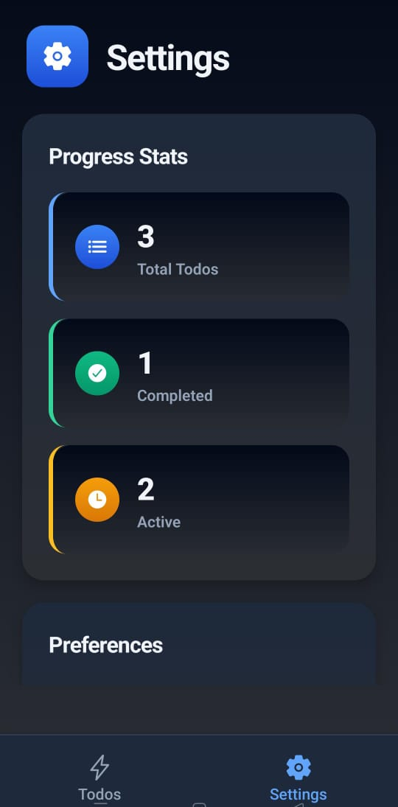

# ✅ TODO-APP-RN

A modern and lightweight **Todo Application** built using **Expo (React Native)** for the frontend and **Convex** as the backend for real-time data sync, persistence, and server-side logic. The project is structured with file-based routing, reusable components, and full TypeScript support for safety and scalability.

---

## 📸 Screenshots
<p align="center">
  
  
</p>


## 🌟 Features

✅ Add new todos  
✅ Toggle completion state  
✅ Delete todos  
✅ Real-time backend sync via Convex  
✅ Type-safe queries and mutations  
✅ Expo Router navigation  
✅ Modular UI components  
✅ Supports iOS, Android & Web  

---

## 🧰 Tech Stack

### **Frontend**
- Expo (React Native)
- Expo Router
- React Hooks
- TypeScript

### **Backend**
- Convex Database + Functions
- Strongly typed API client
- Schema-based data modeling

---

## ✅ Requirements

Make sure the following are installed:

### Required
- **Node.js 16+**
- **npm or yarn**

### Optional (recommended)
#### ✅ Expo CLI
```bash
npm install -g expo-cli
